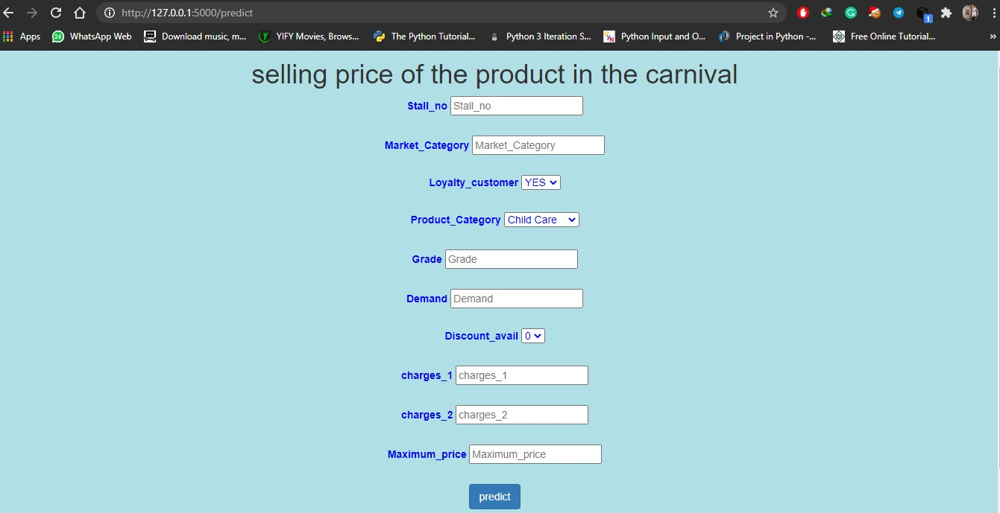
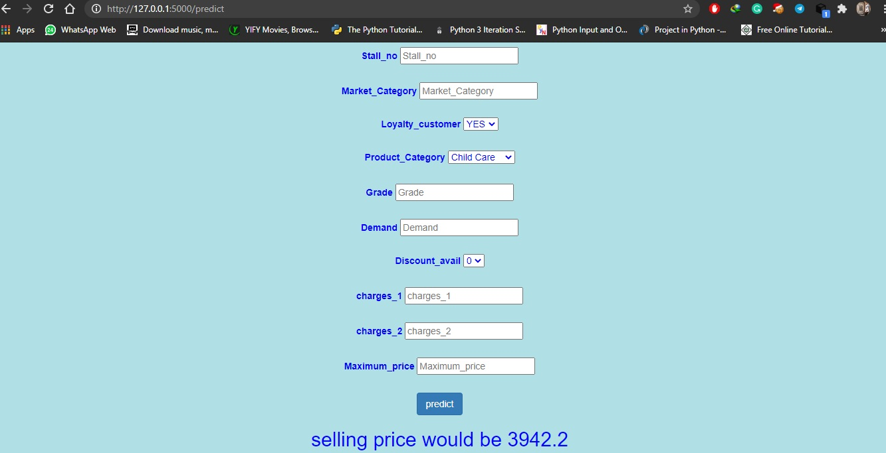

# Deployement-by-flask-and-docker

# 1) Flask
make a virtual environment then open your virtual env in command prompt and apply following command.

pip install -r requirements.txt in your command prompt or power shell.
now we have our main.py file which is very important in flask deployement because it has our machine learning model and we haveto run it in our command prompt and we will get this type of output.

     * Serving Flask app "main" (lazy loading)
     * Environment: production
       WARNING: This is a development server. Do not use it in a production deployment.
       Use a production WSGI server instead.
     * Debug mode: on
     * Restarting with stat
     * Debugger is active!
     * Debugger PIN: 167-950-153
     * Running on http://127.0.0.1:5000/ (Press CTRL+C to quit)
     
open this local host and you will get this type of output in your browser and after adding values the prediction value would be printed below.

# 2) Docker deployement
It is the same as flask with some minor changes. The main modification is that we have to add a dockerfile in main directory, which will be used by docker to perform whatever user want to add in container.

example of dockerfile

      #use python as a base image
      FROM tiangolo/uwsgi-nginx-flask:python3.7

      #working directory
      WORKDIR /app

      #copy all the files which are required for our project would be copy in app folder
      COPY requirements.txt /app
      COPY templates /app/templates
      COPY model.pkl /app

      #this file will install all the dependencies in our virtual env
      RUN pip install -r ./requirements.txt

      COPY main.py /app
      
as we can see that I copied all the required files such as templates folder in which i have created our HTML page , model.pkl is our machine learning model , main.py is our main file.

#### NOTE:- When docker copy requirements.txt file it will run it in the container and install all the dependencies in it that is why we have to create our virtual environment otherwise we will get an error.

### STEP:1 create docker file
### STEP:2 docker build -t api_name
(api_name = whatever name you want to give to your container)
### STEP:3 docker run -p 8000:8000 api_name
(api_name = which is given by us when we build container in step 2
 here we write 8000 port so our website will run on localhost 8000.)
      
# OUTPUT
## initial output

## after adding values

